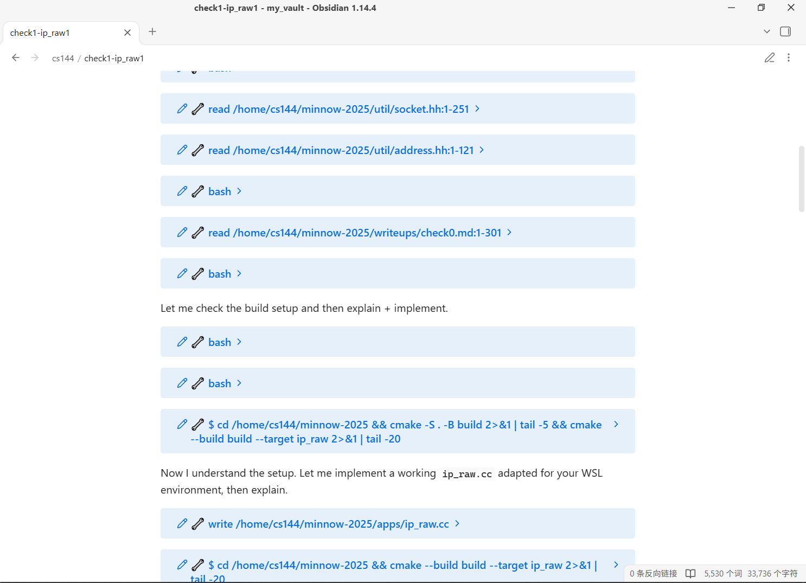

**English** | [简体中文](./README.zh.md)
# pi-md-log

Mirrors Pi session conversation content into a Markdown file by **appending only**,
so the file becomes **your own notes** — edits you make are never touched:
open it in Typora / Obsidian / VS Code, and formulas (LaTeX) plus code fences
stay intact for editing and rendering.

> Difference from [`pi_md_forward`](https://github.com/kkast/pi_md_forward): it treats the Markdown
> file as a *whole-file-regenerated transcript mirror*; this extension treats it
> as *user-owned notes* — it only ever appends to the end of the file and
> **never rewrites or scans existing content**.

## Rendered Result in Obsidian


## Commands

| Command | Meaning |
|---|---|
| `/log-bind <path>` | Bind this session to a Markdown file and start auto-recording. **Records only what happens after the bind — never backfills history.** Creates the file first (with a one-line header comment) if it does not exist |
| `/log-export <path>` | Append the entire active branch (including compaction fold blocks) as one segment. If the file is missing, it is created and written in full; if it exists, content is **appended directly**. **No deduplication, no gap filling** — repeating it appends again (manual command; the file is yours to manage) |
| `/log-unbind` | **Cancel the binding for this session**: stop auto-recording and forget the bound file (`/resume` and `/reload` will not restore it) |

> To "switch to a new tree node, write the whole branch into a file, and keep
> recording" — that is `/log-bind <path>` followed by `/log-export`.

Paths support `~` and relative paths (resolved against the working directory).

## Behavior highlights (design decisions)

- **Binding belongs to the Session**: binding state is stored as a custom entry
  inside the session and validated against the session file on restore.
  - `/fork`, `/clone`, `/new` **never inherit a binding**; bind each session manually.
  - `/resume` of the same file and `/reload`: the binding is restored and recording continues.
  - Different sessions **may** bind the same Markdown file (each appends its own
    content; no cross-session deduplication).
- **/tree node switches**: auto-recording pauses (branches are never mixed into
  one file). Pi's "Navigated to selected point" and the extension notice share
  the same single status slot (the later one overwrites the earlier), so the
  combined notice deliberately replaces Pi's hint: line 1 keeps Pi's original
  text, line 2 is `md-log is suspended, /log-bind to rebind`.
- **Compaction**: compaction fold blocks (`> 📌 Context compacted …`) are
  appended as usual; old messages stay in the JSONL, so `/log-export` also
  writes the pre-compaction history (a fork-like full history).
- **Forward pointer**: bind mode tracks "the last appended entry id" in state,
  appends monotonically, and writes each entry exactly once. It never scans the
  Markdown file, never backfills, and emits no anchor comments.
- **Unbinding**: `/log-unbind` writes a tombstone state entry, so neither
  `/resume` nor `/reload` will restore that binding; a later `/log-bind` starts
  from a fresh pointer (no backfill).
- **Exporting to the bound file** advances the pointer to the current leaf so
  bind and export never double-write the same entries.

## Recorded content defaults

- User messages → `## Q · time` + full text; assistant replies → original
  Markdown (LaTeX preserved).
- **Thinking blocks are not recorded by default**; tool calls/results are
  folded into collapsible blocks — HTML `<details>` by default, or Obsidian
  foldable callouts when `foldStyle` is `"obsidian"`. Short arguments are
  merged into the summary (e.g. `read src/render.ts:10-60`), while long or
  multiline arguments and the result stay in the collapsed body. Long output
  is truncated.
- `!` / `!!` terminal commands (`bashExecution`) are not recorded by default.
- Images are omitted by default (only the count is noted).

## Settings

All settings live in one file:

```
src/pi-md-log.config.json
```

Edit it and run `/reload` (or start a new session) to apply. Nothing is read
from the environment and there is no settings command.

| Key | Default | Meaning |
|---|---|---|
| `includeThinking` | `false` | Record assistant thinking/reasoning blocks |
| `includeBashExecution` | `false` | Record `!` / `!!` terminal commands |
| `outputMaxLines` | `200` | Max lines kept from tool/terminal output |
| `outputMaxBytes` | `20480` | Max bytes kept from tool/terminal output |
| `outputHeadRatio` | `0.4` | Fraction of the output budget kept from the head |
| `commandMaxChars` | `120` | Max chars for a command in a tool `<summary>` |
| `argumentsMaxChars` | `4000` | Max chars for tool arguments / full bash command |
| `bashCommandMaxChars` | `200` | Max chars for a command in a `bashExecution` heading |
| `foldStyle` | `"obsidian"` | Collapsible syntax: `"details"` (`<details>`) or `"obsidian"` (foldable `> [!note]-` callouts) |

## Install & try

```bash
# One-shot try
pi -e ./src/index.ts

# Common: copy into the project for auto-loading (or ~/.pi/agent/extensions/)
mkdir -p .pi/extensions && cp -r src .pi/extensions/pi-md-log
```

## Development

```bash
npm install
npm run typecheck   # tsc --noEmit
npm test            # node test/integration.ts (simulated session; verifies
                    # pointer / bind / export / tree / fork semantics)
```

## File layout

```
src/index.ts        entry: event wiring + command registration
src/controller.ts   state (binding/pointer) and append orchestration
src/render.ts       pure-function rendering (unit-testable)
src/config.ts       settings loader (reads pi-md-log.config.json)
src/pi-md-log.config.json   the single place to configure the extension
src/sanitize.ts     terminal-output cleaning / backtick fence safety (reused from pi_md_forward)
src/truncate.ts     long-output truncation (reused from pi_md_forward)
test/integration.ts integration semantic tests
```
